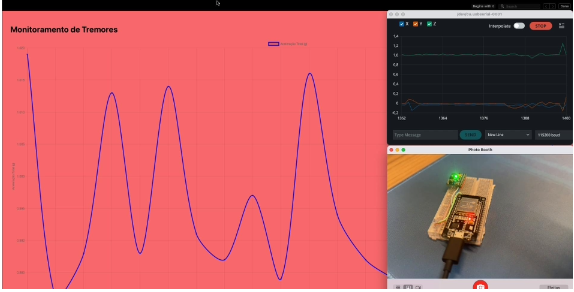

# 2025-GS-Physical-Computing-Robotics-Cognitive-IoT  
### Detecção de Tremores com IA Embarcada e Edge Computing

Sistema de detecção de anomalias usando acelerômetro MPU6050 com ESP32, análise local e envio para backend em FastAPI, com frontend React para visualização gráfica. Projeto desenvolvido para a disciplina *PHYSICAL COMPUTING, ROBOTICS & COGNITIVE IOT* – FIAP 2025.

---

## 📑 Sumário

- [🎥 Demonstração em Vídeo](#🎥-demonstração-em-vídeo)
- [📦 Componentes Utilizados](#📦-componentes-utilizados)
- [🧠 Funcionamento](#🧠-funcionamento)
- [🔧 Configurações](#🔧-configurações)
- [🚀 Execução](#🚀-execução)
- [📘 Relatório](#📘-relatório)
- [🛠️ Tecnologias](#🛠️-tecnologias)
- [🔌 Esquema de Ligações](#🔌-esquema-de-ligações)
- [💾 Código do Dispositivo](#💾-código-do-dispositivo)
- [👥 Equipe](#👥-equipe)
- [📝 Licença](#📝-licença)

---

## 🎥 Demonstração em Vídeo

📽️ [Clique aqui para assistir](https://drive.google.com/file/d/1mZdYq0PmIcGKYq5ovM_R469sQ2BsSEwu/view?usp=sharing)  
[](https://drive.google.com/file/d/1mZdYq0PmIcGKYq5ovM_R469sQ2BsSEwu/view?usp=sharing)

---

## 📦 Componentes Utilizados

- **ESP32** com Wi-Fi
- **MPU6050** (Acelerômetro + Giroscópio)
- **FastAPI** (Backend Python)
- **React** (Frontend para gráficos)
- **BMP085** (opcional – sensor de pressão)

---

## 🧠 Funcionamento

1. O sensor coleta 200 amostras a 200Hz.
2. Os dados são normalizados (aceleração em `g`).
3. O ESP32 envia os dados para o backend via POST (JSON).
4. O backend calcula: `a_total = sqrt(ax² + ay² + az²)`.
5. Se `a_total` estiver fora de `[0.98, 1.01]`, é marcado como anomalia.

---

## 🔧 Configurações

- **WiFi SSID**: SMS Tecnologia  
- **Porta Backend**: `8005`  
- **Taxa de Amostragem**: `200 Hz`  
- **Detecção**: Threshold fixo  
- **Linguagens**: Python (FastAPI), C++ (Arduino), JavaScript (React)

---

## 🚀 Execução

### Backend (FastAPI)
```bash
uvicorn fastapi_server:app --port 8005 --reload

npm install
npm start

Dispositivo (ESP32)

Upload via Arduino IDE do código .ino.

⸻

📘 Relatório

📄 Clique aqui para acessar o Relatório Final (PDF)

🛠️ Tecnologias
Camada
Tecnologia
Backend
FastAPI (Python)
Frontend
React (JavaScript)
Microcontrolador
ESP32 (Arduino C++)
Sensores
MPU6050, BMP085

🔌 Esquema de Ligações

🔗 Visualizar no Wokwi

💾 Código do Dispositivo

O código do ESP32 está disponível em: esp32/anomaly_get_data_v2.ino

⸻

👥 Equipe
	•	André Rovai Andrade Xavier Junior – RM555848@fiap.com.br
	•	Alan de Souza Maximiano da Silva – RM557088@fiap.com.br
	•	Leonardo Zago Garcia Ferreira – RM558691@fiap.com.br

⸻

📝 Licença

Distribuído sob a licença MIT. Consulte o arquivo LICENSE para mais informações.
